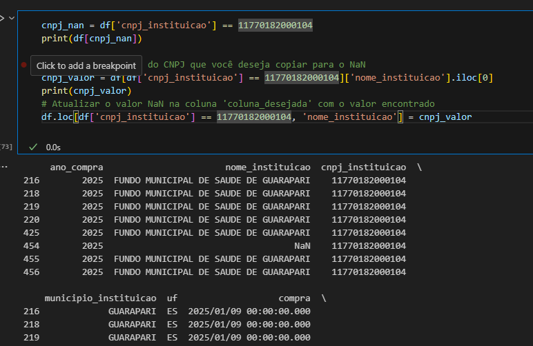
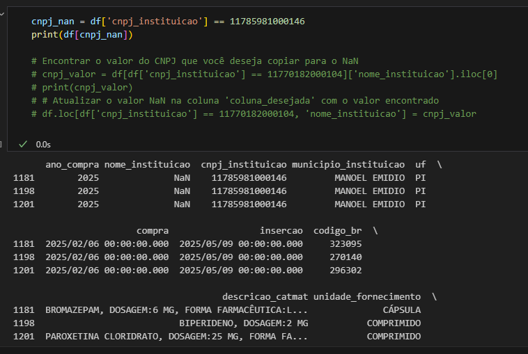

# Projeto_XP

<class 'pandas.core.frame.DataFrame'>
RangeIndex: 2474 entries, 0 to 2473
Data columns (total 27 columns):
 #   Column                           Non-Null Count  Dtype  
---  ------                           --------------  -----  
 0   ano_compra                       2474 non-null   int64  
 1   nome_instituicao                 2466 non-null   object 
 2   cnpj_instituicao                 2474 non-null   int64  
 3   municipio_instituicao            2474 non-null   object 
 4   uf                               2474 non-null   object 
 5   compra                           2474 non-null   object 
 6   insercao                         2474 non-null   object 
 7   codigo_br                        2474 non-null   int64  
 8   descricao_catmat                 2474 non-null   object 
 9   unidade_fornecimento             2474 non-null   object 
 10  generico                         1506 non-null   object 
 11  anvisa                           1506 non-null   float64
 12  modalidade_compra                2474 non-null   object 
 13  tipo_compra                      2474 non-null   object 
 14  capacidade                       930 non-null    float64
 15  unidade_medida                   930 non-null    object 
 16  unidade_fornecimento_capacidade  2474 non-null   object 
 17  cnpj_fornecedor                  2474 non-null   int64  
 18  fornecedor                       2474 non-null   object 
 19  cnpj_fabricante                  2474 non-null   int64  
 20  fabricante                       2474 non-null   object 
 21  qtd_itens_comprados              2474 non-null   int64  
 22  preco_unitario                   2474 non-null   float64
 23  preco_total                      2474 non-null   float64
 24  arquivo                          2474 non-null   object 
 25  pk                               2474 non-null   int64  
 26  dt_criacao_registro              2474 non-null   object 
dtypes: float64(4), int64(7), object(16)
memory usage: 522.0+ KB

percentual dados faltantes
ano_compra                          0.000000
nome_instituicao                    0.323363
cnpj_instituicao                    0.000000
municipio_instituicao               0.000000
uf                                  0.000000
compra                              0.000000
insercao                            0.000000
codigo_br                           0.000000
descricao_catmat                    0.000000
unidade_fornecimento                0.000000
generico                           39.126920
anvisa                             39.126920
modalidade_compra                   0.000000
tipo_compra                         0.000000
capacidade                         62.409054
unidade_medida                     62.409054
unidade_fornecimento_capacidade     0.000000
cnpj_fornecedor                     0.000000
fornecedor                          0.000000
cnpj_fabricante                     0.000000
fabricante                          0.000000
qtd_itens_comprados                 0.000000
preco_unitario                      0.000000
preco_total                         0.000000
arquivo                             0.000000
pk                                  0.000000
dt_criacao_registro                 0.000000
dtype: float64

Municipios que possuiam registros com CPNJ, e dados de nome_instituição, mas com alguns registros de nome de instituição faltantes.
ano_compra nome_instituicao  cnpj_instituicao municipio_instituicao  uf  \
1181        2025              NaN    11785981000146         MANOEL EMIDIO  PI   
1198        2025              NaN    11785981000146         MANOEL EMIDIO  PI   
1201        2025              NaN    11785981000146         MANOEL EMIDIO  PI   
1305        2025              NaN    87958625000149          PORTO ALEGRE  RS   
1311        2025              NaN    87958625000149          PORTO ALEGRE  RS   
1313        2025              NaN    87958625000149          PORTO ALEGRE  RS   
1964        2025              NaN    12157728000100            VILA VELHA  ES   

                       compra                 insercao  codigo_br  \
1181  2025/02/06 00:00:00.000  2025/05/09 00:00:00.000     323095   
1198  2025/02/06 00:00:00.000  2025/05/09 00:00:00.000     270140   
1201  2025/02/06 00:00:00.000  2025/05/09 00:00:00.000     296302   
1305  2025/02/13 00:00:00.000  2025/03/14 00:00:00.000     292194   
1311  2025/02/13 00:00:00.000  2025/03/14 00:00:00.000     267662   
1313  2025/02/13 00:00:00.000  2025/03/14 00:00:00.000     376767   
1964  2025/03/18 00:00:00.000  2025/04/24 00:00:00.000     268236   

                                       descricao_catmat unidade_fornecimento  \
1181  BROMAZEPAM, DOSAGEM:6 MG, FORMA FARMACÊUTICA:L...              CÁPSULA   
1198                           BIPERIDENO, DOSAGEM:2 MG           COMPRIMIDO   
1201  PAROXETINA CLORIDRATO, DOSAGEM:25 MG, FORMA FA...           COMPRIMIDO   
1305  HALOPERIDOL, APRESENTAÇÃO:SAL DECANOATO, CONCE...               AMPOLA   
1311                         FLUCONAZOL, DOSAGEM:150 MG              CÁPSULA   
1313                     IVERMECTINA, CONCENTRAÇÃO:6 MG           COMPRIMIDO   
1964  CLORETO DE SÓDIO, PRINCÍPIO ATIVO:0,9%_ SOLUÇÃ...               FRASCO   

      ... cnpj_fornecedor                                         fornecedor  \
1181  ...  10436813000182                                    MAIS SAUDE LTDA   
1198  ...  10436813000182                                    MAIS SAUDE LTDA   
1201  ...  10436813000182                                    MAIS SAUDE LTDA   
1305  ...  44734671002286     CRISTALIA PRODUTOS QUIMICOS FARMACEUTICOS LTDA   
1311  ...   6294126000100                    RS - PRODUTOS HOSPITALARES LTDA   
1313  ...  94389400000184           MCW PRODUTOS MEDICOS E HOSPITALARES LTDA   
1964  ...   4380569000180  J R G DISTRIBUIDORA DE MEDICAMENTOS HOSPITALAR...   

     cnpj_fabricante                                      fabricante  \
1181  60666000000000         UNIAO QUIMICA FARMACEUTICA NACIONAL S A   
1198  44734700000000  CRISTALIA PRODUTOS QUIMICOS FARMACEUTICOS LTDA   
1201   2814500000000                            CIMED INDUSTRIA S.A.   
1305  44734671000151  CRISTALIA PRODUTOS QUIMICOS FARMACEUTICOS LTDA   
1311  17875154000120         MEDQUIMICA INDUSTRIA FARMACEUTICA LTDA.   
1313  30222814000131           VITAMEDIC INDUSTRIA FARMACEUTICA LTDA   
1964  58635830000175              FARMARIN INDUSTRIA E COMERCIO LTDA   

     qtd_itens_comprados  preco_unitario preco_total  \
1181                2000          0.1900      380.00   
1198               27500          0.3300     9075.00   
1201               12500          0.2400     3000.00   
1305                5560          3.8500    21406.00   
1311               12550          0.4200     5271.00   
1313               37200          0.1948     7246.56   
1964              100000          4.6600   466000.00   

                          arquivo    pk      dt_criacao_registro  
1181  Extracao_Novo_BPS_2025.xlsx  1182  2025/07/29 13:20:05.738  
1198  Extracao_Novo_BPS_2025.xlsx  1199  2025/07/29 13:20:05.738  
1201  Extracao_Novo_BPS_2025.xlsx  1202  2025/07/29 13:20:05.738  
1305  Extracao_Novo_BPS_2025.xlsx  1306  2025/07/29 13:20:05.738  
1311  Extracao_Novo_BPS_2025.xlsx  1312  2025/07/29 13:20:05.738  
1313  Extracao_Novo_BPS_2025.xlsx  1314  2025/07/29 13:20:05.738  
1964  Extracao_Novo_BPS_2025.xlsx  1965  2025/07/29 13:20:05.738  

[7 rows x 25 columns]

### Todos registro com o mesmo cnpj estão com nome instituição como NAN
os registros serão descatados

dicionario 
#### Documentação dos dados
* <b>Codigo BR</b> -Código do item, conforme o Catálogo de Materiais (CATMAT), este código é um identificador único utilizado para padronizar os produtos no mercado de saúde brasileiro, facilitando a comparação de preços e a consulta de dados.
* <b>Descrição CATMAT</b> - Descrição do item conforme o Catálogo de Materiais (CATMAT), que especifica o nome e as características do medicamento ou insumo, padronizando a nomenclatura para facilitar a identificação.
* <b>Unidade de Fornecimento</b> - Unidade na qual o item é fornecido e comercializado (ex.: comprimido, ampola, frasco). Define a forma de apresentação do produto para padronização e comparabilidade nas aquisições de insumos de saúde.
* <b>Generico</b> - Indica se o item é um medicamento genérico, conforme a regulamentação da Agência Nacional de Vigilância Sanitária (Anvisa).
* <b>Compra</b> - Data da compra informada pela instituição compradora.
* <b>Modalidade da Compra</b> - Modalidade utilizada para a aquisição do item, como licitação, pregão, compra direta, entre outras, conforme a legislação de compras públicas. A modalidade define o processo seguido na aquisição do item.
* <b>Insercao</b> - Data de inserção da informação no sistema BPS, permitindo o acompanhamento e a atualização dos regibos ao longo do tempo.
* <b>Tipo de compra</b> - Tipo Compra Classificação da compra, como emergencial, regular, entre outras, para indicar o contexto ou a natureza da aquisição. Este campo ajuda a contextualizar a necessidade e a urgência da compra realizada
* <b>Fabricante</b> Nome da empresa que fabrica o medicamento ou insumo adquirido. O fabricante é responsável pela produção e qualidade do produto.
* <b>CNPJ Fabricante</b> Cadabo Nacional da Pessoa Jurídica (CNPJ) do fabricante, utilizado para identificar a empresa responsável pela produção do medicamento ou insumo no mercado brasileiro.
* <b>Fornecedor</b> Nome da empresa que forneceu o item à instituição. O fornecedor é responsável pela entrega do produto, muitas vezes em parceria com o fabricante.
* <b>CNPJ Fornecedor</b> Cadabo Nacional da Pessoa Jurídica (CNPJ) do fornecedor, utilizado para identificar a empresa que realizou a venda e entrega do produto à instituição.
* <b>Nome Instituição</b> Nome da instituição que realizou a compra do item, como hospitais, secretarias de saúde e outras entidades do Sistema Único de Saúde (SUS) ou privadas.
* <b>CNPJ Instituição</b> Cadabo Nacional da Pessoa Jurídica (CNPJ) da instituição compradora, que identifica a entidade responsável pela aquisição do item.
* <b>Município Instituição</b>Município onde a instituição compradora está localizada. Este campo permite análises geográficas sobre a dibibuição das aquisições
* <b>UF</b> Unidade Federativa (UF) da instituição compradora. Identifica o estado brasileiro em que a instituição está localizada.
* <b>Qtd Itens Comprados</b> Quantidade do item adquirida na transação. Informa o volume comprado pela instituição e permite análises de demanda e consumo
* <b>Preco Unitario</b> Preço pago por unidade do item adquirido. Este valor é informado com base no valor efetivamente negociado e permite a comparação de preços entre diferentes compras e fornecedores.